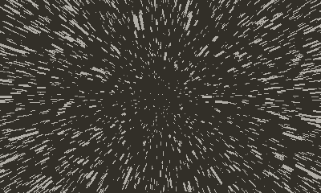

# Starfield\*

Basically a port from Rust to C of [this project](https://github.com/Pomettini/starfield-playdate-rs) that is also a port of [Daniel Shiffman's Starfield p5.js sketch](https://thecodingtrain.com/challenges/1-starfield) for the [Playdate](https://play.date/)

Just turn the crank forward to accelerate. Have fun!

## Why porting a Rust project over to C

This one does not throw a stack overflow when the stars are over a certain number like the other project (which needs investigation). In fact, it is able to display **10000 particles at screen** at runtime without using any pre-computed value at _~20 fps_

## Installation

First you need to install the [Playdate SDK](https://play.date/dev/), then use your terminal to move inside the project folder and run

    make

Then drag the `starfield.pdx` file on your Playdate Simulator or [sideload it on your device](https://play.date/account/sideload/)

\* The name has nothing to do with the game [Starfield](https://bethesda.net/en/game/starfield)
